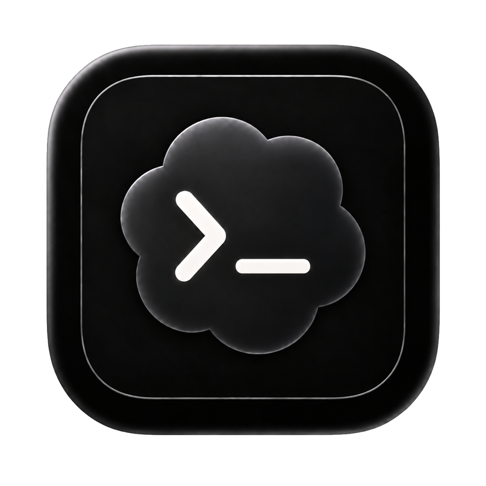
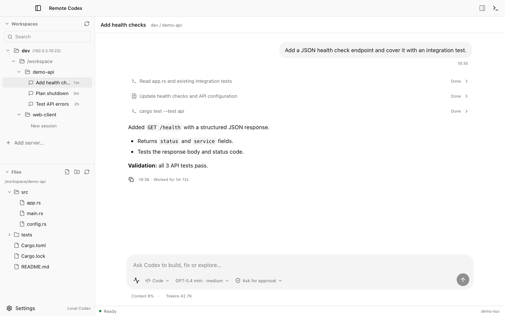
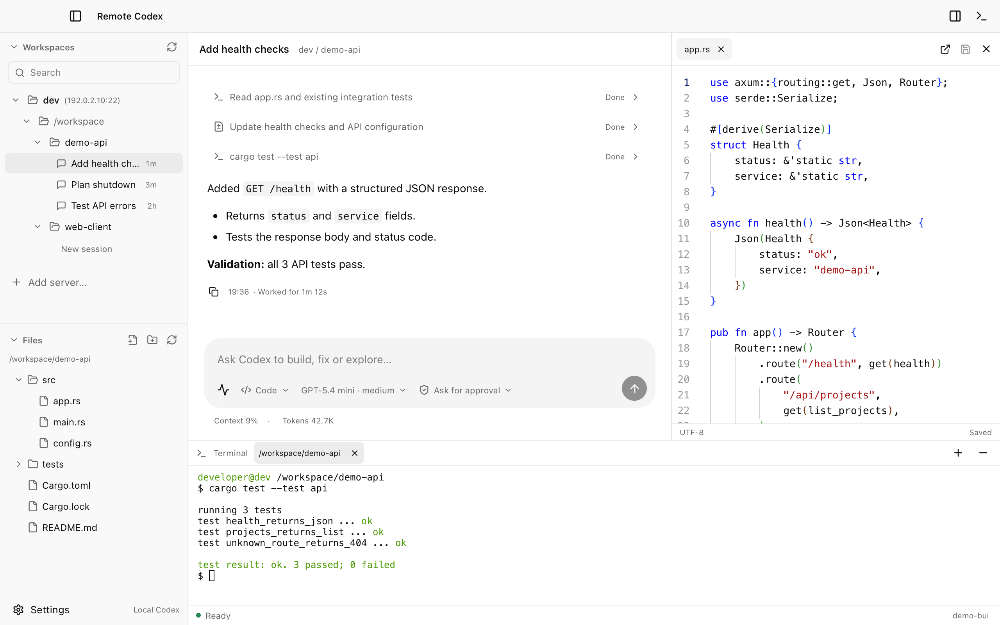
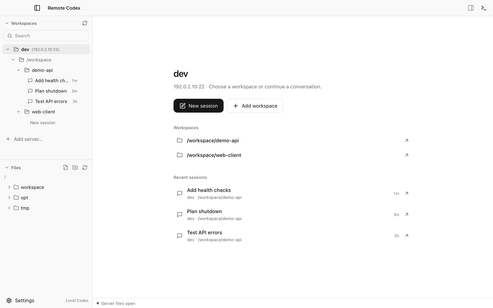
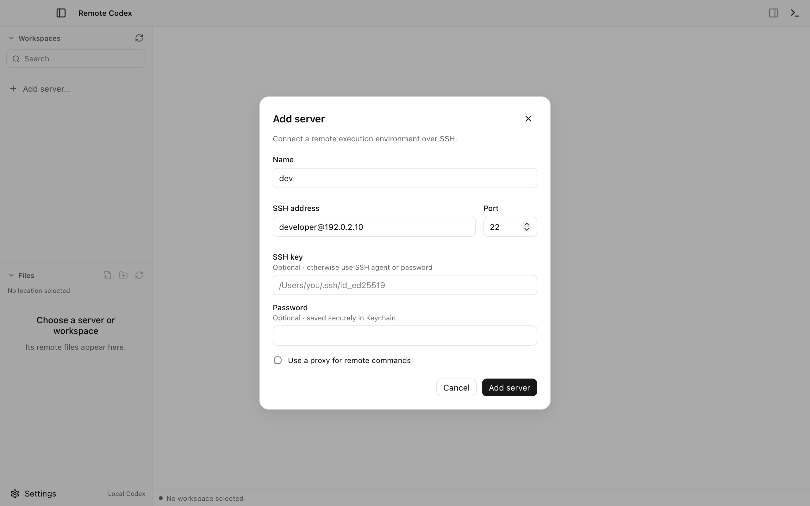
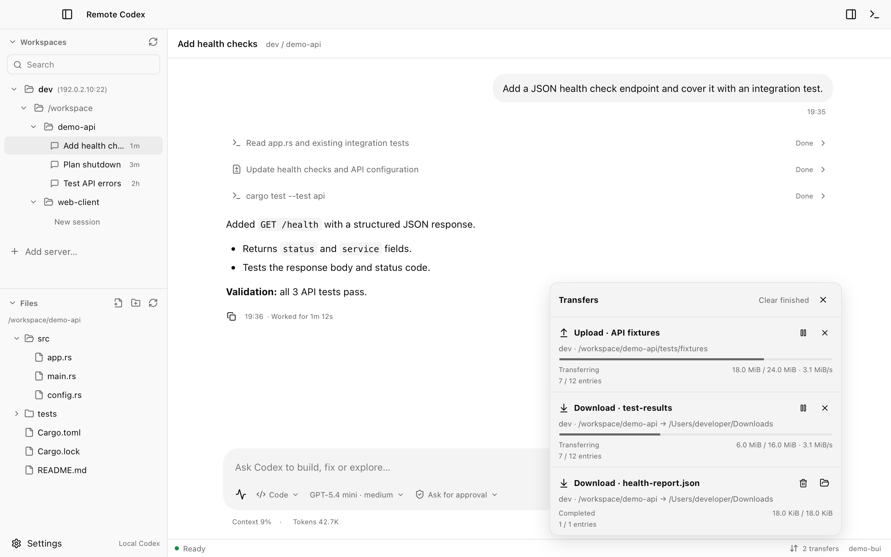
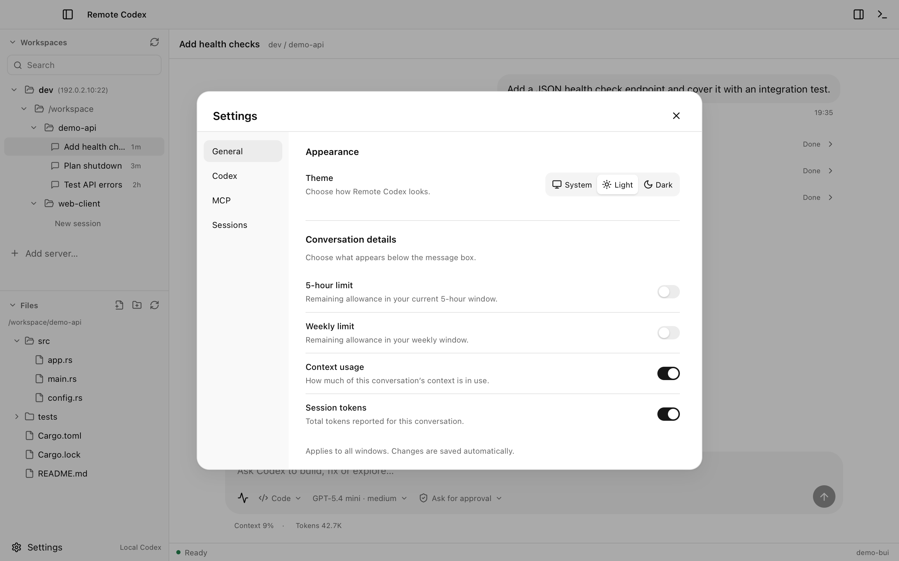

<p align="center">
  
</p>
<h1 align="center">Remote Codex</h1>
<p align="center"><strong>Local Codex. Remote execution.</strong></p>

Remote Codex provides a desktop application and CLI for using local Codex sessions
with remote development environments over SSH. Authentication and session history
remain local, while project files and command execution reside on the remote server.
Saved servers and sessions are shared between the desktop application and CLI.

[Download](https://github.com/touale/remote-codex/releases) · [Installation](#installation) · [Usage](#usage) · [Contributing](CONTRIBUTING.md)

## Features

- **Workspaces and sessions:** manage remote servers, workspaces, and conversations across the desktop app and CLI.
- **Files and terminals:** edit and compare files, transfer folders, and work in integrated remote terminals.
- **Planning and goals:** revise plans and continue persistent goals with optional token budgets.
- **Skills and MCP:** reuse local Skills and run MCP servers locally or remotely.
- **Connection recovery:** reconnect automatically and restore sessions after execution environment interruptions.

<table align="center">
  <tr>
    <td width="50%" align="center" valign="top">
      <strong>Session</strong><br><br>
      <a href="assets/screenshots/session.png"></a>
    </td>
    <td width="50%" align="center" valign="top">
      <strong>Editor &amp; terminal</strong><br><br>
      <a href="assets/screenshots/development-workspace.png"></a>
    </td>
  </tr>
  <tr>
    <td width="50%" align="center" valign="top">
      <strong>Server home</strong><br><br>
      <a href="assets/screenshots/server-home.png"></a>
    </td>
    <td width="50%" align="center" valign="top">
      <strong>Add server</strong><br><br>
      <a href="assets/screenshots/add-server.png"></a>
    </td>
  </tr>
  <tr>
    <td width="50%" align="center" valign="top">
      <strong>File transfers</strong><br><br>
      <a href="assets/screenshots/file-transfers.png"></a>
    </td>
    <td width="50%" align="center" valign="top">
      <strong>Settings</strong><br><br>
      <a href="assets/screenshots/settings.png"></a>
    </td>
  </tr>
</table>

## Installation

### Requirements

| Component | Supported environment |
| --- | --- |
| Local platform | macOS on Apple Silicon; macOS 13 or later for the desktop application |
| Remote server | Linux x86_64 with SSH access and a writable home directory |
| Codex CLI | Installed locally |

### Prebuilt binaries

Get the latest release from [GitHub Releases](https://github.com/touale/remote-codex/releases).

#### Desktop app

Download the DMG, open it, and drag **Remote Codex** into **Applications**.

#### CLI

Download the CLI executable. In the download directory, run:

```sh
mkdir -p "$HOME/.local/bin"
install -m 755 remote-codex "$HOME/.local/bin/remote-codex"
```

If `~/.local/bin` is not on PATH, add this line to `~/.zshrc` and open a new terminal:

```sh
export PATH="$HOME/.local/bin:$PATH"
```

### Build from source

See the [source build instructions](CONTRIBUTING.md#build-from-source).

### Prepare local Codex

Reuse an existing Codex installation, or follow its
[official installation instructions](https://github.com/openai/codex#quickstart).
With npm:

```sh
npm install -g @openai/codex
codex --version
```

Make `codex` available on PATH. If authentication is required, sign in using either:

- **Desktop:** open **Settings → Codex → Sign in with ChatGPT**.
- **CLI:** run `codex login`.

If the desktop app does not detect Codex, enter its absolute path under
**Settings → Codex → Codex executable** and select **Use this installation**.

## Usage

### Desktop app

1. Click **Add server** and enter the SSH connection details.
2. Right-click the server in the sidebar, choose **Add workspace**, and select a remote project directory.
3. Double-click the workspace, click **New session**, and send your first message.

To resume a conversation, click its session in the sidebar.

### CLI

Add a server and start a session, replacing the example host and workspace path:

```sh
remote-codex server add -n dev --addr developer@host -p 22
remote-codex -n dev --path /workspace/project
```

Omit `--path` to select a directory interactively. Starting or resuming a session
automatically connects to its server.

| Operation | Command |
| --- | --- |
| List servers | `remote-codex server list` |
| Browse sessions | `remote-codex resume --all` |
| Browse sessions on a server | `remote-codex resume -n dev --all` |
| Resume a session | `remote-codex resume SESSION_ID` |
| Open a remote shell | `remote-codex shell -n dev` |
| Remove a saved server | `remote-codex server remove dev` |

Removing a saved server preserves remote files and local Codex history.
Run `remote-codex --help` for additional options.

## Configuration

**Server settings.** Configuration is stored per server. View its settings with:

```sh
remote-codex config list -n dev
```

SSH keys, agents, and saved passwords are supported. Server proxy settings apply
to remote commands; local Codex uses the local network configuration.

**Skills and MCP.** Enabled Skill resources are prepared on the remote server;
install their required dependencies separately. Locally configured MCP servers run
locally. Remote project stdio MCP servers run on the server after explicit trust
and can be managed under **Settings → MCP**.

## FAQ

### Does the server need a separate Codex installation or login?

No. Remote Codex automatically installs a verified execution package matching the
local Codex version. Login is handled locally. If the local version is incompatible
or its official execution package is unavailable, Remote Codex reports an error.

### Where is data stored?

- **Codex history:** `~/.codex` by default, or the directory specified by `CODEX_HOME`. Codex manages its own login credentials locally.
- **Saved servers, workspace and session indexes, and caches:** `~/Library/Application Support/remote-codex` on macOS, unless a custom data directory is configured.
- **Saved SSH passwords:** macOS Keychain.

Project files are accessed on the remote server. Conversation history can include
remote file contents and command output; local history is not limited to chat text.

### What happens when the connection drops?

Submitted remote commands continue running by default. While the local client
remains open, Remote Codex retries the connection and checks interrupted work before
continuing. Closing the client stops further AI scheduling. After a server reboot,
the session can be restored, but the original running processes cannot survive.

## Contributing

See [CONTRIBUTING.md](CONTRIBUTING.md) for source builds, development setup, project
structure, and validation. Report reproducible problems through
[Issues](https://github.com/touale/remote-codex/issues) and submit changes through
[Pull requests](https://github.com/touale/remote-codex/pulls).

## License

[MIT](LICENSE) © 2026 Touale. Third-party dependencies retain their own licenses.
